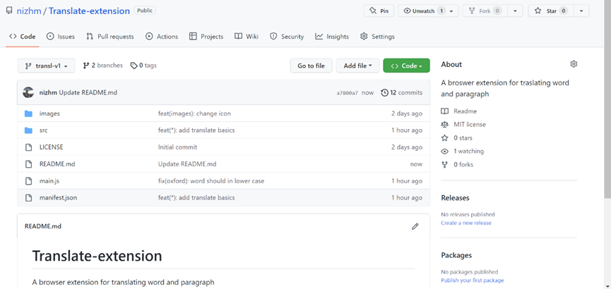
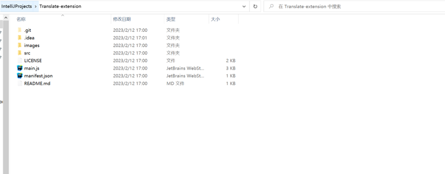
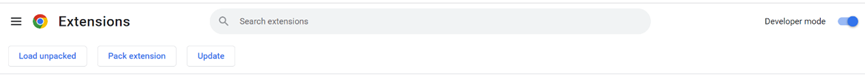
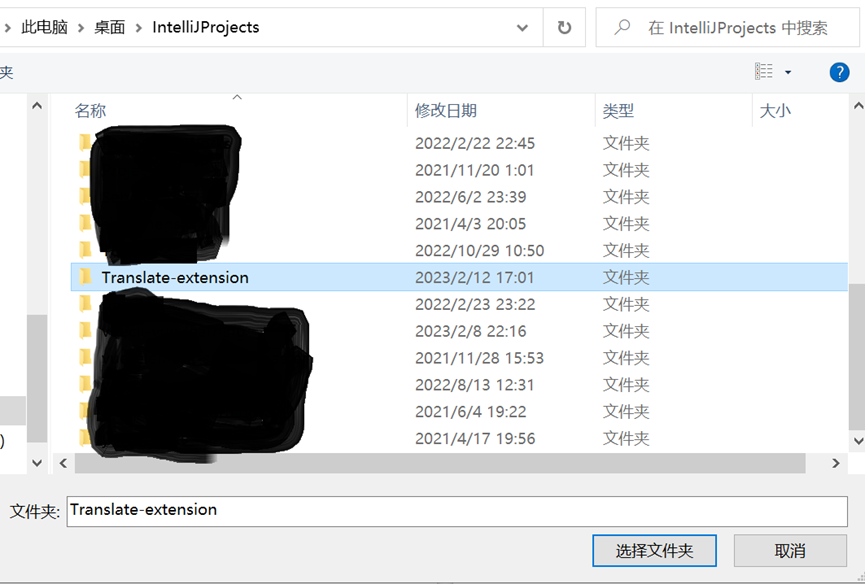
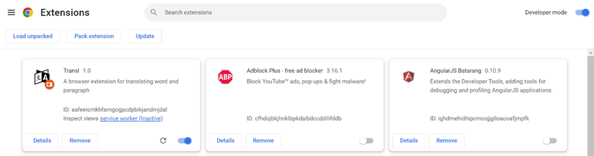
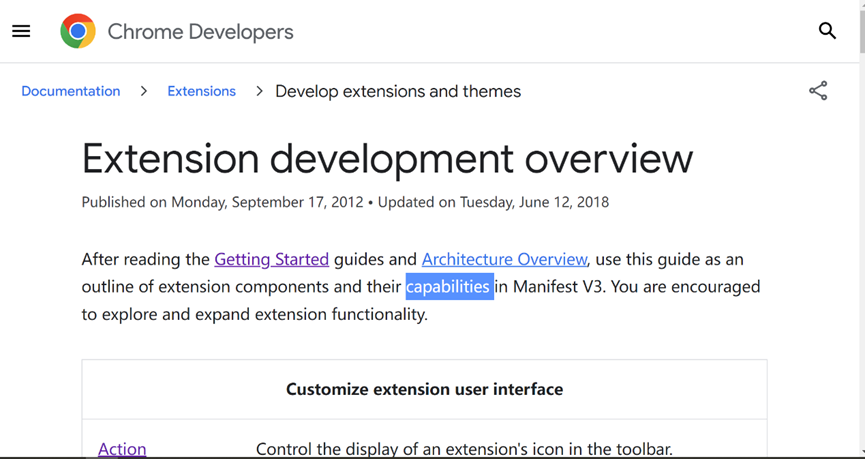
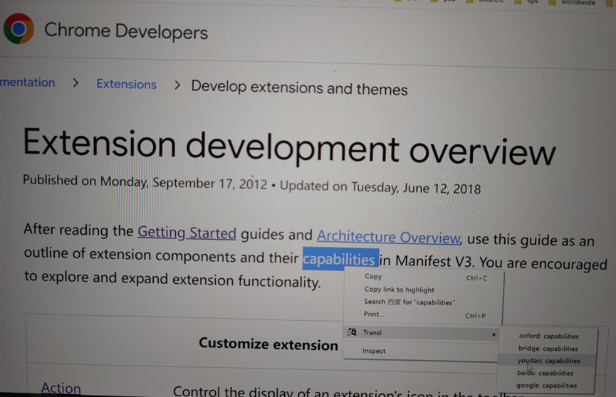
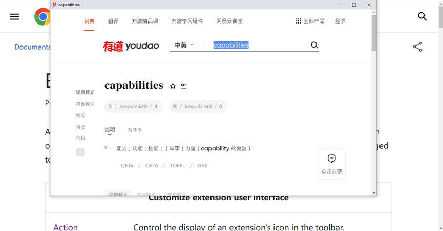

# Translate-extension
A browser extension for translating word and paragraph

# 1 Installation and Usage

### 1.1 Download project to local from [GitHub](https://github.com/nizhm/Translate-extension)

### 1.2 Open browser's extension management page and enable developer mode

### 1.3 To load local extension by click 'Load unpacked'

### 1.4 Browse any English site and select a word or a piece of sentence

### 1.5 Press down right mouse and select one translate approach

### 1.6 View translate result

